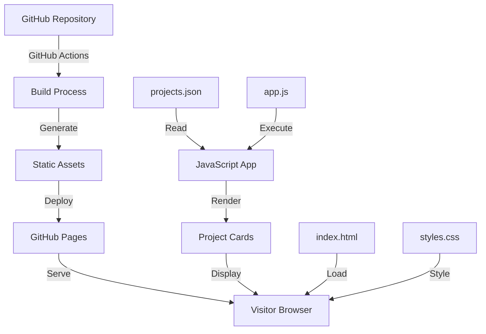

# Design Document: GitHub Pages Showroom

## Overview

The GitHub Pages Showroom is a static web application that provides a visual, interactive interface for browsing Context Engineering projects. It transforms the tabular Projects Tracker data into an engaging visual experience using modern web technologies.

The showroom consists of a single-page application built with vanilla HTML, CSS, and JavaScript. It reads project data from a static JSON file and renders interactive project cards in a responsive grid layout. The application is designed to be hosted on GitHub Pages with automatic deployment via GitHub Actions.

Key design principles:
- Static-first architecture (no backend dependencies)
- Progressive enhancement (works without JavaScript for basic content)
- Mobile-first responsive design
- Accessibility as a core requirement
- Performance-optimized for fast loading

## Architecture

### System Components



### Architecture Layers

1. **Data Layer**: Static JSON file containing project metadata
2. **Presentation Layer**: HTML structure and CSS styling
3. **Interaction Layer**: JavaScript for dynamic rendering and interactivity
4. **Deployment Layer**: GitHub Actions workflow for automated deployment

### Technology Stack

- HTML5 for semantic structure
- CSS3 with CSS Grid and Flexbox for responsive layouts
- Vanilla JavaScript (ES6+) for interactivity
- GitHub Actions for CI/CD
- GitHub Pages for hosting

### Design Decisions

**Why vanilla JavaScript instead of a framework?**
- Minimal bundle size for fast loading
- No build complexity for a simple static site
- Easy maintenance without framework dependencies
- GitHub Pages works seamlessly with static files

**Why static JSON instead of fetching from GitHub API?**
- No rate limiting concerns
- Faster load times (no API latency)
- Works offline after initial load
- Simpler deployment process

## Components and Interfaces

### Component Hierarchy

```
Showroom (Root)
├── Header
│   ├── Title
│   └── Navigation (optional)
├── ProjectGrid
│   └── ProjectCard (multiple)
│       ├── CardImage (optional)
│       ├── CardTitle
│       ├── CardDescription
│       └── CardLink
└── Footer
    └── RepositoryLink
```

### Component Specifications

#### Showroom (Root Component)
- Manages application state
- Loads project data from JSON
- Handles responsive layout breakpoints
- Coordinates animations and transitions

#### Header Component
- Displays "Context Engineering Projects" title
- Provides visual branding
- Fixed or sticky positioning for navigation

#### ProjectGrid Component
- Responsive grid container
- Adapts column count based on viewport width:
  - Mobile (< 768px): 1 column
  - Tablet (768px - 1024px): 2 columns
  - Desktop (> 1024px): 3 columns
- Handles card spacing and alignment

#### ProjectCard Component
- Visual representation of a single project
- Interactive hover states
- Clickable area linking to project URL
- Displays project metadata

Properties:
- `name`: Project name (string)
- `description`: Project description (string)
- `url`: Project repository or documentation URL (string)
- `tags`: Optional array of technology tags (string[])

#### Footer Component
- Links back to repository
- Displays copyright or attribution
- Minimal visual footprint

### Interface Contracts

#### Project Data Interface

```javascript
interface Project {
  name: string;           // Project name
  description: string;    // Brief description
  url: string;           // Project URL
  tags?: string[];       // Optional technology tags
  image?: string;        // Optional project thumbnail
}

interface ProjectData {
  projects: Project[];
  lastUpdated: string;   // ISO 8601 timestamp
}
```

#### DOM Event Interfaces

- Card click: Opens project URL in new tab
- Card hover: Triggers visual feedback animation
- Keyboard navigation: Tab through cards, Enter to activate
- Window resize: Triggers responsive layout recalculation

## Data Models

### Project Data Model

The core data structure representing a project:

```javascript
{
  "name": "UI Garden",
  "description": "A collection of reusable UI components and patterns",
  "url": "https://github.com/context-engineering/ui-garden",
  "tags": ["UI", "Components", "React"],
  "image": "assets/ui-garden-preview.png"
}
```

### Projects Collection Model

The complete dataset loaded by the application:

```javascript
{
  "projects": [
    {
      "name": "UI Garden",
      "description": "A collection of reusable UI components and patterns",
      "url": "https://github.com/context-engineering/ui-garden",
      "tags": ["UI", "Components", "React"]
    }
  ],
  "lastUpdated": "2024-01-15T10:30:00Z"
}
```

### File Structure

```
docs/                          # GitHub Pages root
├── index.html                 # Main HTML file
├── styles.css                 # Stylesheet
├── app.js                     # JavaScript application
├── projects.json              # Project data
└── assets/                    # Optional images
    └── *.png
```

### Data Flow

1. Browser loads `index.html`
2. HTML references `styles.css` and `app.js`
3. JavaScript loads and parses `projects.json`
4. For each project in data:
   - Create ProjectCard DOM element
   - Attach event listeners
   - Append to ProjectGrid
5. Apply responsive layout based on viewport
6. Enable animations and transitions


## Correctness Properties

A property is a characteristic or behavior that should hold true across all valid executions of a system—essentially, a formal statement about what the system should do. Properties serve as the bridge between human-readable specifications and machine-verifiable correctness guarantees.

### Property 1: Complete Project Rendering

For any valid project dataset, when the showroom loads that data, the number of rendered ProjectCard elements in the DOM should equal the number of projects in the dataset.

**Validates: Requirements 1.1**

### Property 2: Project Card Content Completeness

For any project in the dataset, the rendered ProjectCard should contain DOM elements displaying the project's name, description, and URL.

**Validates: Requirements 1.2**

### Property 3: Click Navigation Correctness

For any ProjectCard with a valid URL, when a visitor clicks the card, the navigation event should target the correct project URL from the dataset.

**Validates: Requirements 2.1**

### Property 4: New Tab Navigation

For any ProjectCard element, the link should have the target attribute set to "_blank" or equivalent to open in a new tab.

**Validates: Requirements 2.2**

### Property 5: Invalid URL Error Handling

For any project with an invalid or malformed URL, the rendered ProjectCard should display an error indicator or fallback state.

**Validates: Requirements 2.3**

### Property 6: Responsive Width Tolerance

For any viewport width between 320px and 2560px, rendering the showroom should not cause horizontal overflow or layout breakage.

**Validates: Requirements 4.4**

### Property 7: Hover Animation Activation

For any ProjectCard element, when a hover event is triggered, the element should apply animation classes or style changes that create visual feedback.

**Validates: Requirements 1.4, 5.1**

### Property 8: Entrance Animation Application

For any ProjectCard element, when the showroom completes initial rendering, the element should have entrance animation classes or styles applied.

**Validates: Requirements 5.2**

### Property 9: Interactive Element Transitions

For any interactive element in the showroom, the computed styles should include CSS transition properties for smooth state changes.

**Validates: Requirements 5.3**

### Property 10: Keyboard Navigation Accessibility

For any ProjectCard element, the element should be focusable via keyboard (tabindex >= 0 or naturally focusable) and respond to Enter/Space key events for activation.

**Validates: Requirements 6.1**

### Property 11: Accessibility Attribute Completeness

For any interactive element in the showroom, the element should have appropriate ARIA labels, roles, or semantic HTML attributes that enable screen reader announcements.

**Validates: Requirements 6.2, 6.4**

### Property 12: Text Contrast Compliance

For any text element in the showroom, the contrast ratio between the text color and its background color should be at least 4.5:1.

**Validates: Requirements 6.3**

### Property 13: Static Data Source

For any data loading operation, the showroom should read project data from a static JSON file or embedded data structure, not from a remote API or database.

**Validates: Requirements 7.3**

## Error Handling

### Error Categories

1. **Data Loading Errors**
   - Missing projects.json file
   - Malformed JSON syntax
   - Invalid project data structure
   - Network errors (if fetching JSON)

2. **Rendering Errors**
   - Invalid project URLs
   - Missing required fields (name, description, url)
   - DOM manipulation failures

3. **User Interaction Errors**
   - Click events on invalid links
   - Keyboard navigation failures
   - Focus management issues

### Error Handling Strategies

#### Data Loading Errors

```javascript
async function loadProjects() {
  try {
    const response = await fetch('projects.json');
    if (!response.ok) {
      throw new Error(`HTTP error: ${response.status}`);
    }
    const data = await response.json();
    return validateProjectData(data);
  } catch (error) {
    console.error('Failed to load projects:', error);
    displayErrorMessage('Unable to load projects. Please try again later.');
    return { projects: [] }; // Return empty array as fallback
  }
}
```

#### Rendering Errors

- Validate each project object before rendering
- Skip projects with missing required fields
- Display placeholder cards for invalid projects
- Log validation errors to console for debugging

```javascript
function validateProject(project) {
  const required = ['name', 'description', 'url'];
  const missing = required.filter(field => !project[field]);
  
  if (missing.length > 0) {
    console.warn(`Project missing fields: ${missing.join(', ')}`, project);
    return false;
  }
  
  return true;
}
```

#### User Interaction Errors

- Gracefully handle invalid URLs with try-catch
- Provide visual feedback for failed actions
- Ensure keyboard navigation has fallback focus targets
- Log interaction errors for monitoring

### Error Recovery

- Display user-friendly error messages
- Provide retry mechanisms for data loading
- Maintain partial functionality when possible
- Never crash the entire application due to single project errors

## Testing Strategy

### Dual Testing Approach

The showroom will be validated using both unit tests and property-based tests to ensure comprehensive coverage:

- **Unit tests**: Verify specific examples, edge cases, and error conditions
- **Property tests**: Verify universal properties across all inputs

Together, these approaches provide comprehensive coverage where unit tests catch concrete bugs and property tests verify general correctness.

### Unit Testing

Unit tests will focus on:

1. **Specific Examples**
   - Header contains "Context Engineering Projects" title (Requirement 8.2)
   - Footer contains link to repository (Requirement 8.3)
   - Mobile viewport (< 768px) displays single column (Requirement 4.1)
   - Tablet viewport (768-1024px) displays two columns (Requirement 4.2)
   - Desktop viewport (> 1024px) displays three columns (Requirement 4.3)

2. **Edge Cases**
   - Empty project dataset
   - Project with missing optional fields (tags, image)
   - Very long project names or descriptions
   - Special characters in project data
   - Minimum viewport width (320px)
   - Maximum viewport width (2560px)

3. **Error Conditions**
   - Malformed JSON data
   - Missing projects.json file
   - Invalid URL formats
   - Network failures during data loading

4. **Integration Points**
   - DOM manipulation and rendering
   - Event listener attachment
   - CSS class application
   - Local storage (if used for caching)

### Property-Based Testing

Property-based tests will use **fast-check** (JavaScript property-based testing library) to verify universal properties across randomly generated inputs.

Each property test will:
- Run a minimum of 100 iterations
- Generate random valid inputs
- Verify the property holds for all inputs
- Reference the design document property in a comment tag

#### Property Test Configuration

```javascript
import fc from 'fast-check';

// Example property test structure
describe('GitHub Pages Showroom Properties', () => {
  it('Property 1: Complete Project Rendering', () => {
    fc.assert(
      fc.property(
        fc.array(projectArbitrary()),
        (projects) => {
          // Feature: github-pages-showroom, Property 1: Complete Project Rendering
          const rendered = renderShowroom(projects);
          const cardCount = rendered.querySelectorAll('.project-card').length;
          return cardCount === projects.length;
        }
      ),
      { numRuns: 100 }
    );
  });
});
```

#### Property Test Coverage

Each correctness property (1-13) will be implemented as a single property-based test:

1. **Property 1**: Generate random project arrays, verify card count matches
2. **Property 2**: Generate random projects, verify each card contains name/description/URL
3. **Property 3**: Generate random projects with URLs, verify click targets correct URL
4. **Property 4**: Generate random projects, verify all links have target="_blank"
5. **Property 5**: Generate projects with invalid URLs, verify error indicators
6. **Property 6**: Generate random viewport widths (320-2560px), verify no overflow
7. **Property 7**: Generate random cards, verify hover applies animation classes
8. **Property 8**: Generate random projects, verify entrance animations applied
9. **Property 9**: Generate random interactive elements, verify transition styles present
10. **Property 10**: Generate random cards, verify keyboard focusability and activation
11. **Property 11**: Generate random interactive elements, verify ARIA attributes present
12. **Property 12**: Generate random text elements, verify contrast ratio >= 4.5:1
13. **Property 13**: Verify data loading always uses static source

#### Arbitrary Generators

Custom generators for property tests:

```javascript
// Generate valid project objects
function projectArbitrary() {
  return fc.record({
    name: fc.string({ minLength: 1, maxLength: 100 }),
    description: fc.string({ minLength: 1, maxLength: 500 }),
    url: fc.webUrl(),
    tags: fc.option(fc.array(fc.string(), { maxLength: 5 })),
    image: fc.option(fc.webUrl())
  });
}

// Generate viewport widths
function viewportWidthArbitrary() {
  return fc.integer({ min: 320, max: 2560 });
}

// Generate color values for contrast testing
function colorArbitrary() {
  return fc.record({
    r: fc.integer({ min: 0, max: 255 }),
    g: fc.integer({ min: 0, max: 255 }),
    b: fc.integer({ min: 0, max: 255 })
  });
}
```

### Test Environment

- **Test Framework**: Jest or Vitest
- **Property Testing Library**: fast-check
- **DOM Testing**: jsdom or happy-dom
- **Coverage Target**: 80% code coverage minimum
- **CI Integration**: Run tests on every pull request

### Manual Testing

In addition to automated tests, manual testing will verify:

- Visual design consistency across browsers
- Animation smoothness and timing
- Accessibility with real screen readers (NVDA, JAWS, VoiceOver)
- Touch interactions on mobile devices
- Performance on various network speeds
