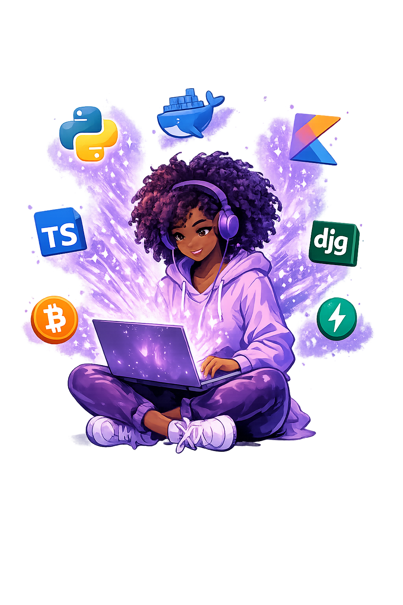

  

<h1 align="center">Context Engineering Hub 💜</h1>
 

   
 

  <b>Portfolio + Project Tracker</b> 
  Android • Web • Python • AI • Bitcoin

  

## About Me

Hi! I'm **Shakiran Nannyombi** — a developer building projects across **Android**, **Web**, **Python**, **AI**, and **Bitcoin**.

This repository is my public **portfolio** + **project management hub** for all my context-engineered projects.

> **Note:** I'm not a "vibe coder" — that's way too far-fetched 😂. I prefer to call it **context engineering** because let's be real, we're crafting prompts and contexts, not vibes!

## Featured Projects
>
> (I'll update these as I finish more projects)

- **Coming Soon** -> Still cooking 😂
-

## Projects Tracker

| Project | Category | Status | Repo |
|--------|----------|--------|------|
| Coming soon | AI | ✅ Done | (link) |
| Coming soon | Android | 🧱 Building | (link) |
| Coming soon | Bitcoin/Research | 💡 Idea | (link) |

## Project Roadmap Board

  

    I manage progress using GitHub Projects.

  
👉 <strong>Context Engineering Roadmap:</strong> <a href="https://github.com/users/Shakiran-Nannyombi/projects/4">@Context Engineering Roadmap</a>

## Tech Stack

  
  
  
  
  
  
  
  

## Context Engineering Energy

  
   
  <i>Always Cooking</i>

## Contact

If you'd like to collaborate or build something cool together, feel free to reach out 💜
