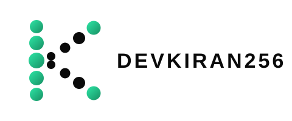

<br><br>

<h1 align="center">AI-Powered Projects by Shakiran</h1>
 <p align="center">
   <picture>
     <source media="(prefers-color-scheme: dark)" srcset="assets/devkiran256-lockup-dark.svg">
     <source media="(prefers-color-scheme: light)" srcset="assets/devkiran256-lockup-light.svg">
     
   </picture>
 </p>

<p align="center">
  <b>Exploring AI, frontend engineering, and user-centered digital experiences through real-world projects.</b>
</p>

<p align="center">
  
</p>

## About Me

Hi! I'm **Shakiran Nannyombi** building under the brand **@DevKiran256** across **AI**, **Android**, **Web**, **Python**, and **Bitcoin**.

This repository is my public **portfolio + project management hub** for all my context-engineered projects.

> **Note:** I'm not a "vibe coder" that's way too far-fetched 😂. I prefer to call it **context engineering** because let's be real, we're crafting prompts and contexts, not vibes!

## View My Projects

**[→ Visit the Project Showroom](https://www.shakiran.dev/aiprojects/)**

Explore my completed projects in an interactive visual gallery with live demos and source code.

The live showroom is served from the portfolio site at `/aiprojects/` (GitHub Pages). After editing this repo’s `docs/`, sync into the portfolio with:

```bash
./scripts/sync-aiprojects.sh
```

Then commit and push `Shakiran-myPortfolio` so the custom domain picks up the update. The old `shakiran.me` CNAME on this repo has been retired.

## Project Documentation

**[→ Read the Full Project Documentation](https://aifest-workshop.notion.site/Context-Engineering-Projects-Tracker-Project-Documentation-344e4543f8438188a281fafcab8d0a73)**

Detailed technical documentation is available on Notion, including architecture, workflows, deployment, and maintenance guidance.

## Master Prompts & Development Board

I manage all project development using GitHub Projects, where each project includes:
- **Master Prompts**: The core AI prompts that powered the project's development

**[→ View Master Prompts](https://github.com/users/Shakiran-Nannyombi/projects/4)**

## Tech Stack

<p>
  
  
  
  
  
  
  
  
</p>

## Context Engineering Energy

<p align="center">
  
  <br/>
  <i>Always Cooking</i>
</p>

## Contact

If you'd like to collaborate or build something cool together, feel free to reach out — **Code · Build · Learn · Share** 💚
